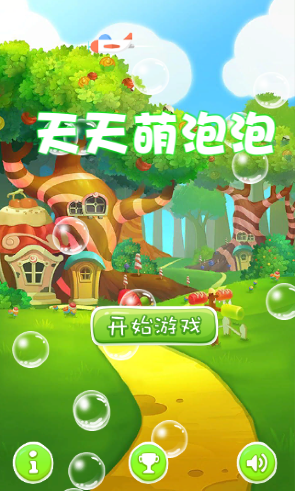
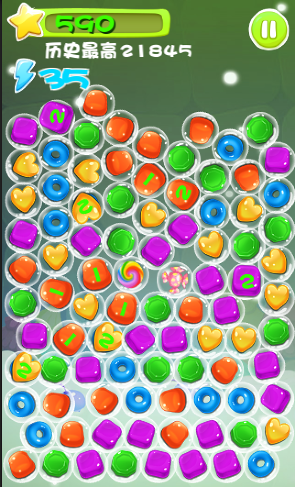
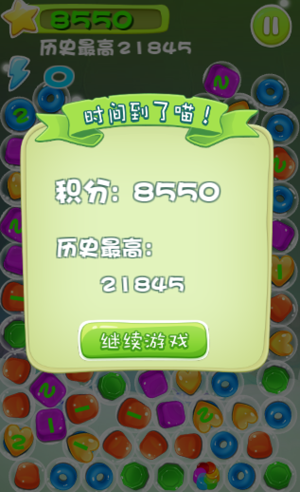

## 《天天萌泡泡》
   《天天萌泡泡》是一款简单好玩的消除游戏，点击三个或以上同颜色、相连接的泡泡来进行消除，简单而有趣。
   
______
   
####  **游戏玩法：**
类似消灭星星的玩法，点击三个或以上同颜色、相连接的泡泡进行消除。 一次消除的元素越多，就会产生越厉害的特殊泡泡。点击特殊泡泡能大量消除其他泡泡，获得更高的分数。游戏是限时模式。

#### 游戏展示
[**WebGL 展示地址 https://build.cloud.unity3d.com/share/W1jjk3nJtZ/webgl/**](https://build.cloud.unity3d.com/share/W1jjk3nJtZ/webgl/)

#### 游戏下载
[**腾讯应用宝下载地址:** http://android.myapp.com/myapp/detail.htm?apkName=com.superzhan.bubblegame](http://android.myapp.com/myapp/detail.htm?apkName=com.superzhan.bubblegame)

[游戏下载 腾讯应用宝下载地址](http://www.superzhan.cn/wp-content/uploads/2016/03/%E5%A4%A9%E5%A4%A9%E8%90%8C%E6%B3%A1%E6%B3%A1.apk)

______

#### 开始
运行Scene/MainScene 场景开始游戏。**开发环境是unity5.2.3 ,低版本的unity可能会报错。**

#### 开发环境
	Unity 5.2.3
	UI: UGUI
	插件: 2dtoolkit, poolManger, AudioToolkit, DOTween
	资源：网络素材+PS修改
	使用Unity内置的物理引擎
	
#### 工程结构
	Scene目录 工程只有一个场景MainScene,从这里开始游戏。
	Script目录 所有的程序代码位于这个文件夹下
	Prefab目录 存放游戏的所有预设
	Image目录  图片资源目录
	Audio目录 声音文件
	Resources目录 存放游戏的配置数据
	其他目录 插件和部分资源

